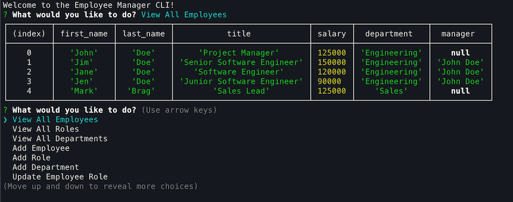

# Employee Manager
[](https://opensource.org/licenses/MIT)

## Description
Employee Manager is a CLI for managing a MySQL database of departments, roles, and employees. It provides a handful of different functions so check out the demo video to see an example of it in action.

## Table of Contents
* [Installation](#installation)
* [Usage](#usage)
* [License](#license)
* [Contributing](#contributing)
* [Tests](#tests)
* [Questions](#questions)

## Installation
```
git clone <repo url>
cd <project folder>
npm install
```

## Usage
```
node index.js
```

## License
[MIT](https://opensource.org/licenses/MIT)

## Contributing
No contributions at this time.

## Tests
```
No tests.
```

## Questions
If you have any questions you can reach out to me on [Github](https://github.com/brhue).
